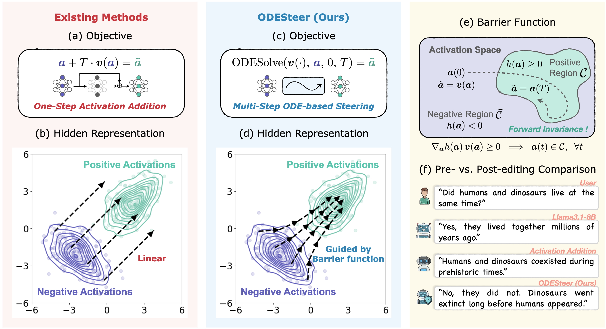

# ODESteer: A Unified ODE-Based Steering Framework for LLM Alignment

Official implementation of the paper **"ODESteer: A Unified ODE-Based Steering Framework for LLM Alignment"** (ICLR 2026)

This repository provides code for ODESteer, a novel activation steering approach based on ordinary differential equations and barrier functions from control theory.

[Paper](https://openreview.net/forum?id=CFewUmgIIL), [Website](https://odesteer.github.io/)



## Installation

### Prerequisites

- Python 3.10 or higher
- CUDA-compatible GPU (recommended for running LLMs)
- [uv](https://docs.astral.sh/uv/) package manager

### Setup

1. **Install uv** (if not already installed): please follow instructions in https://docs.astral.sh/uv/getting-started/installation/

2. **Clone the repository**:
   ```bash
   git clone git@github.com:ZhaoHongjue/odesteer.git
   cd odesteer
   ```

3. **Install dependencies**:
   ```bash
   uv sync
   ```
   This will automatically create a virtual environment and install all required packages.

4. **Set up API keys** (required for detoxification evaluation):

   For toxicity evaluation, you need a [Perspective API](https://perspectiveapi.com/) key:

   a. Create a `.env` file in the project root:
   ```bash
   echo "GOOGLE_API_KEY=your_api_key_here" > .env
   ```

   b. Export the environment file:
   ```bash
   export UV_ENV_FILE=.env
   ```

## Quick Start

Here's a minimal example to run ODESteer on TruthfulQA with Llama-3.1-8B:

```bash
# 1. Prepare data
uv run bash data/truthfulqa.sh

# 2. Generate responses with ODESteer
uv run python -u scripts/truthfulqa/truthfulqa_generate.py \
    model=Llama3.1-8B-Base \
    layer_idx=13 \
    steer=ODESteer \
    steer.T=5.0

# 3. Evaluate results
uv run python -u scripts/truthfulqa/truthfulqa_eval.py -m Llama3.1-8B-Base -l 13 -d
```

## Data Preparation

```bash
uv run bash data/ultrafeedback.sh
uv run bash data/truthfulqa.sh
uv run bash data/toxicity.sh
```

These scripts will:
- Download and format the each dataset
- Extract activations from the specified model at the specified layer

**Note**: For toxicity data preparation, you need Kaggle API credentials configured (`~/.kaggle/kaggle.json`).

## Running Experiments

### Helpfulness (Ultrafeedback)

**Generate responses**:
```bash
uv run python -u scripts/ultrafeedback/ultrafeedback_generate.py \
    model=<MODEL> \
    layer_idx=<LAYER> \
    steer=<STEER> \
    steer.T=<T_VALUE>
```

**Evaluate responses**:
```bash
uv run python -u scripts/ultrafeedback/ultrafeedback_eval.py -m <MODEL> -l <LAYER> -d
```
The command will automatically evaluate all steering methods with the specific model and layer.

**Example - Compare ODESteer with baseline methods**:
```bash
# No steering (baseline)
uv run python -u scripts/ultrafeedback/ultrafeedback_generate.py \
    model=Llama3.1-8B-Base layer_idx=13 steer=NoSteer

# CAA
uv run python -u scripts/ultrafeedback/ultrafeedback_generate.py \
    model=Llama3.1-8B-Base layer_idx=13 steer=CAA steer.T=1.0

# ODESteer (our method)
uv run python -u scripts/ultrafeedback/ultrafeedback_generate.py \
    model=Llama3.1-8B-Base layer_idx=13 steer=ODESteer steer.T=5.0

# Evaluate
uv run python -u scripts/ultrafeedback/ultrafeedback_eval.py -m Llama3.1-8B-Base -l 13 -d
```

### Truthfulness (TruthfulQA)

**Generate responses**:
```bash
uv run python -u scripts/truthfulqa/truthfulqa_generate.py \
    model=<MODEL> \
    layer_idx=<LAYER> \
    steer=<STEER> \
    steer.T=<T_VALUE>
```

**Evaluate responses**:
```bash
uv run python -u scripts/truthfulqa/truthfulqa_eval.py -m <MODEL> -l <LAYER> -d
```


### Detoxification (RealToxicityPrompts)

**Generate responses**:
```bash
uv run python -u scripts/toxicity/detox_generate.py \
    model=<MODEL> \
    layer_idx=<LAYER> \
    steer=<STEER> \
    steer.T=<T_VALUE>
```

**Evaluate responses**:
```bash
uv run python -u scripts/toxicity/detox_eval.py -m <MODEL> -l <LAYER> -d
```


## Supported Models and Methods

### Models

| Model Name | HuggingFace Path | Recommended Layer |
|------------|-----------------|-------------------|
| `Llama3.1-8B-Base` | `meta-llama/Llama-3.1-8B` | 13 |
| `Mistral-7B-Base` | `mistralai/Mistral-7B-v0.1` | 15 |
| `Falcon-7B-Base` | `tiiuae/falcon-7b` | 14 |
| `Qwen2.5-7B-Base` | `Qwen/Qwen2.5-7B` | 13 |

**Note:** The steering layer indices reported in our paper differ slightly from those used here, as this implementation starts counting from zero.

### Steering Methods

**Baselines:**

- `NoSteer` - No steering (baseline)
- `RepE` - [Paper](http://arxiv.org/abs/2310.01405), [Code](https://github.com/andyzoujm/representation-engineering)
- `CAA` - [Paper](https://aclanthology.org/2024.acl-long.828/), [Code](https://github.com/nrimsky/CAA)
- `ITI` - [Paper](https://proceedings.neurips.cc/paper_files/paper/2023/hash/81b8390039b7302c909cb769f8b6cd93-Abstract-Conference.html), [Code](https://github.com/likenneth/honest_llama)
- `MiMiC` - [Paper](https://openreview.net/forum?id=GwA4go0Mw4), [Code](https://github.com/shauli-ravfogel/affine-steering)
- `LinAcT` - [Paper](https://openreview.net/forum?id=l2zFn6TIQi), [Code](https://github.com/apple/ml-act)
- `HPR` - [Paper](https://aclanthology.org/2024.emnlp-main.761/), [Code](https://github.com/VinAIResearch/HPR)
- `RE-Control` - [Paper](http://arxiv.org/abs/2406.05954), [Code](https://github.com/Lingkai-Kong/RE-Control)
- `TruthFlow`- [Paper](http://arxiv.org/abs/2502.04556), [Code](https://github.com/wwwhy725/TruthFlow)

**ODESteer (our methods)**:
- `ODESteer` - Barrier function-guided ODE Steering (main method)
- `StepODESteer` - One-step ODESteer variant

**Note:** For DNN-based steering methods (HPR, RE-Control, and TruthFlow), please refer to corresponding official repos for detailed implementation.


## Project Structure

```
odesteer/
├── src/odesteer/           # Main package
│   ├── lm/                 # Language model wrappers
│   ├── steer/              # Steering methods implementation
│   └── utils/              # Utilities (kernels, metrics, data loading)
├── scripts/                # Experiment scripts
│   ├── ultrafeedback/      # Ultrafeedback generation & evaluation
│   ├── truthfulqa/         # TruthfulQA generation & evaluation
│   └── toxicity/           # Detoxification generation & evaluation
├── data/                   # Data preparation scripts
│   ├── ultrafeedback/      # Ultrafeedback data preprocessing
│   ├── truthfulqa/         # TruthfulQA data processing
│   └── toxicity/           # Toxicity data processing
├── confs/                  # Hydra configuration files
├── results/                # Generated outputs (auto-created)
└── pyproject.toml          # Project dependencies
```

## Citation

```bibtex
@inproceedings{zhao2026odesteer,
      title={ODESteer: A Unified ODE-Based Steering Framework for LLM Alignment},
      author={author={Hongjue Zhao* and Haosen Sun* and Jiangtao Kong and
               Xiaochang Li and Qineng Wang and Liwei Jiang and Qi Zhu and 
               Tarek F. Abdelzaher and Yejin Choi and Manling Li† and Huajie Shao†},
      booktitle={The Fourteenth International Conference on Learning Representations},
      year={2026},
      url={https://odesteer.github.io/},
}
```